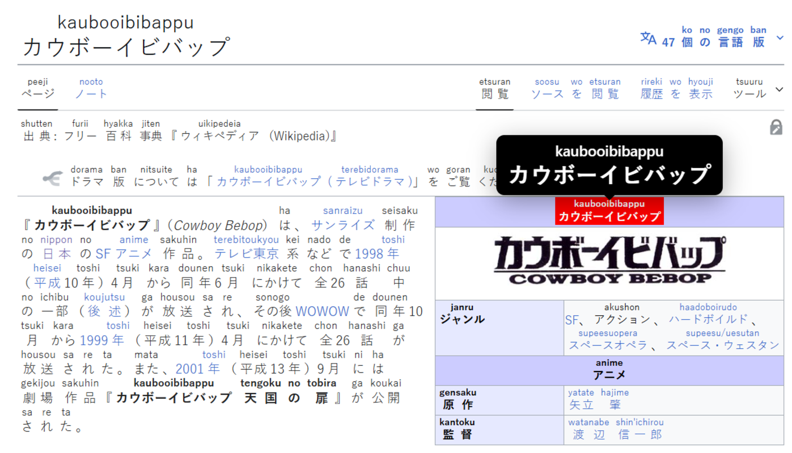

# Jisuke

**字助（じすけ）**

Jisuke is a lightweight browser extension that adds [rōmaji](https://en.wikipedia.org/wiki/Romanization_of_Japanese) above Japanese text using [Ruby](https://developer.mozilla.org/en-US/docs/Web/HTML/Reference/Elements/ruby) annotations.
It provides reading support for users engaging with Japanese content online, whether for study or everyday browsing.

### A few things to know:
- After installation, Jisuke will automatically add rōmaji on top of any Japanese text, so no activation is needed.
- Jisuke only processes Japanese text when it becomes visible on screen. This prevents large websites from causing unnecessary processing, keeping it lightweight.
- Jisuke handles dynamic page changes, automatically processing new text as it appears on the screen.
- Jisuke only reads webpage text to generate rōmaji locally. No data is collected or sent externally.

**Note:** Some names or rare kanji may produce incorrect readings or may not display any rōmaji above.

## Preview
Source: [Cowboy Bebop Wikipedia page (Japanese)](https://ja.wikipedia.org/wiki/%E3%82%AB%E3%82%A6%E3%83%9C%E3%83%BC%E3%82%A4%E3%83%93%E3%83%90%E3%83%83%E3%83%97)

## Setup
Jisuke is only available for [Chromium-based browsers](https://en.wikipedia.org/wiki/Chromium_(web_browser)) (e.g. Google Chrome, Microsoft Edge).

### Chrome Web Store
If you use a Chromium-based browser, you may add Jisuke to Chrome from the following link:
https://chromewebstore.google.com/detail/jisuke/aleojdjeopiaadfljlafcdmjkdflihbe

**Note:** Chrome Web Store uploads take a few days to be reviewed, so the latest version of Jisuke may not always be available on the store.

### Local Setup
1. Download the repository as ZIP.

2. Extract the folder from ZIP.

3. Load the extension in a Chromium-based browser:
    - Open the extensions page:
        - for Google Chrome: `chrome://extensions`
        - for Microsoft Edge: `edge://extensions`
    - Enable Developer Mode.
    - Click on `Load unpacked`.
    - Select the extracted folder.
    
4. Test by going to any site containing Japanese text.

## Contributions
Contributions, reporting issues and feature requests are welcome. Feel free to submit an issue or open a pull request.

## Credits
This project would not be possible without the following open-source projects:

- Kuromoji.js: https://github.com/takuyaa/kuromoji.js
    - Licensed under the Apache License 2.0.
    - Used components:
        - `dict/`
        - `kuromoji.js`

- WanaKana: https://github.com/WaniKani/WanaKana
    - Licensed under the MIT License.
    - Used component: `wanakana.min.js`

## Built With
- Node.js: https://nodejs.org
- Kuromoji.js: https://github.com/takuyaa/kuromoji.js
- WanaKana: https://github.com/WaniKani/WanaKana

